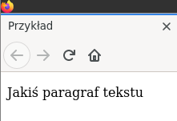
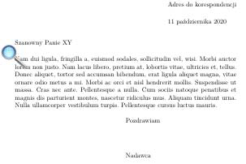
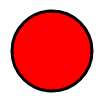
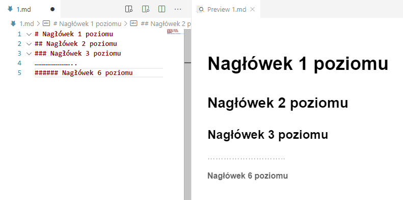
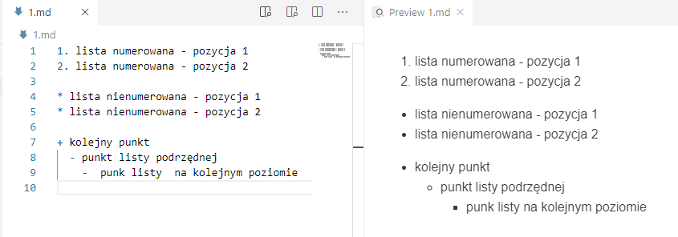
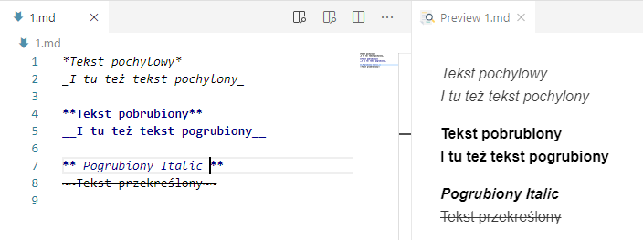
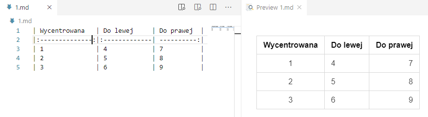

# Lekcja 1 – Markdown lekki język znaczników

## Spis treści

[toc]

## Wstęp

Obecnie powszechnie wykorzystuje się języki ze znacznikami do opisania dodatkowych informacji
umieszczanych w plikach tekstowych. Z pośród najbardziej popularnych można wspomnieć o:

1. **html** – służącym do opisu struktury informacji zawartych na stronach internetowych,
2. **Tex** (Latex) – poznany na zajęciach język do „profesjonalnego” składania tekstów,
3. **XML** ( _Extensible Markup Language)_ - uniwersalnym języku znaczników przeznaczonym do
    reprezentowania różnych danych w ustrukturalizowany sposób.

Przykład kodu html i jego interpretacja w przeglądarce:

```html
<!DOCTYPE html>
<html>
<head>
<meta charset="utf-8" />
<title>Przykład</title>
</head>
<body>
<p> Jakiś paragraf tekstu</p>
</body>
</html>
```



Przykład kodu Latex i wygenerowanego pliku w formacie pdf

```latex
\documentclass[]{letter}
\usepackage{lipsum}
\usepackage{polyglossia}
\setmainlanguage{polish}
\begin{document}
\begin{letter}{Szanowny Panie XY}
\address{Adres do korespondencji}
\opening{}
\lipsum[2]
\signature{Nadawca}
\closing{Pozdrawiam}
\end{letter}
\end{document}
```



Przykład kodu XML – fragment dokumentu SVG (Scalar Vector Graphics)


```xml
<!DOCTYPE html>
<html>
<body>
<svg height="100" width="100">
<circle cx="50" cy="50" r="40" stroke="black" stroke-width="3" fill="red" />
</svg>
</body>
</html>
```



W tym przypadku mamy np. znacznik np. < circle > opisujący parametry koła i który może być właściwie zinterpretowany przez dedykowaną aplikację (np. przeglądarki www).
Jako ciekawostkę można podać fakt, że również pakiet MS Office wykorzystuje format XML do
przechowywania informacji o dodatkowych parametrach formatowania danych. Na przykład pliki z rozszerzeniem _docx_, to nic innego jak spakowane algorytmem zip katalogi z plikami xml.

$unzip -l test.docx
Archive: test.docx

| Length |    Date    | Time  |             Name             |
| :----: | :--------: | :---: | :--------------------------: |
|  573   | 2020-10-11 | 18:20 |         _rels/.rels          |
|  731   | 2020-10-11 | 18:20 |      docProps/core.xml       |
|  508   | 2020-10-11 | 18:20 |       docProps/app.xml       |
|  531   | 2020-10-11 | 18:20 | word/_rels/document.xml.rels |
|  1421  | 2020-10-11 | 18:20 |      word/document.xml       |
|  2429  | 2020-10-11 | 18:20 |       word/styles.xml        |
|  853   | 2020-10-11 | 18:20 |      word/fontTable.xml      |
|  241   | 2020-10-11 | 18:20 |      word/settings.xml       |
|  1374  | 2020-10-11 | 18:20 |     [Content_Types].xml      |


Wszystkie te języki znaczników cechują się rozbudowaną i złożoną składnią i dlatego do ich edycji wymagają najczęściej dedykowanych narzędzi w postaci specjalizowanych edytorów. By wyeliminować powyższą niedogodność powstał **Markdown** - uproszczony język znaczników służący do formatowania dokumentów tekstowych (bez konieczności używania specjalizowanych narzędzi). Dokumenty w tym formacie można bardzo łatwo konwertować do wielu innych formatów: np. html, pdf, ps (postscript), epub, xml i wiele innych. Format ten jest powszechnie używany do tworzenia plików README.md (w projektach open source) i powszechnie obsługiwany przez serwery git’a. Język ten został stworzony w 2004 r. a jego twórcami byli John Gruber i Aaron Swartz. W kolejnych latach podjęto prace w celu stworzenia standardu rozwiązania i tak w 2016 r. opublikowano dokument [RFC 7764]() który zawiera opis kilku odmian tegoż języka:

* CommonMark,
* GitHub Flavored Markdown (GFM),
* Markdown Extra.

## Podstawy składni

Podany link: [https://github.com/adam-p/markdown-here/wiki/Markdown-Cheatsheet]() zawiera opis podstawowych elementów składni w języku angielskim. Poniżej zostanie przedstawiony ich krótki opis w języku polskim.

### Definiowanie nagłówków

W tym celu używamy znaku kratki

Lewe okno zawiera kod źródłowy - prawe - podgląd przetworzonego tekstu




### Definiowanie list



Listy numerowane definiujemy wstawiając numery kolejnych pozycji zakończone kropką.

Listy nienumerowane definiujemy znakami: *,+,-


### Wyróżnianie tekstu




### Tabele



Centrowanie zawartości kolumn realizowane jest poprzez odpowiednie użycie znaku  dwukropka ":" .

### Odnośniki do zasobów

[odnośnik do zasobów] ([www.gazeta.pl]())

[odnośnik do pliku] (LICENSE.md)

[odnośnik do kolejnego zasobu] [1]

[1] : http://google.com